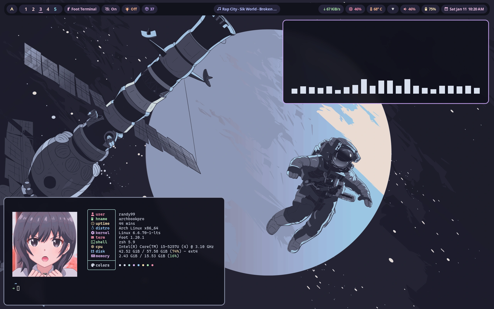
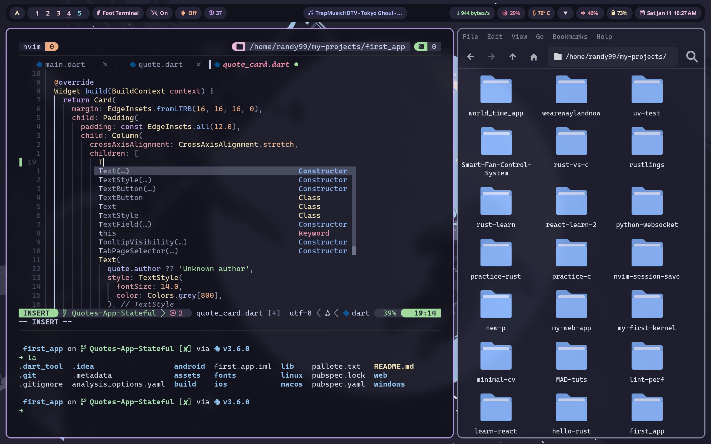
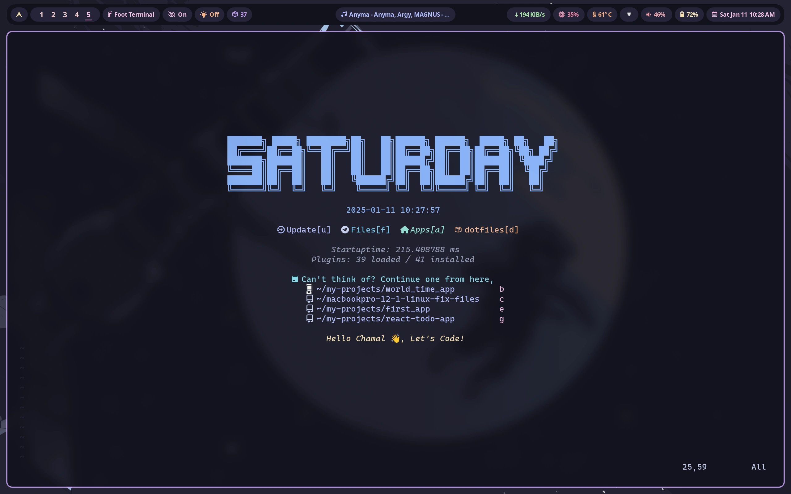
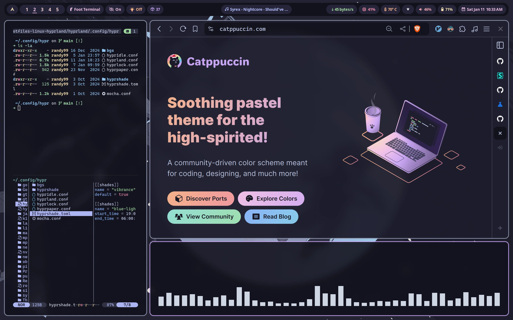

<div align="center">

# Dotfiles

Everything that I'm currently daily driving on Linux.


</div>

## Previews





## What's in?

01. WM - Hyprland
02. Bar - Hyprpanel(default), waybar
03. Terminal emulator - Foot (default), Kitty
04. Shell - zsh
05. Terminal multiplexer - Tmux
06. Nerd font - CaskaydiaCove Nerd Font
07. Text editor and IDE - Neovim
08. Browser - Vivaldi
09. File Manager - Thunar
10. Document viewer - Zathura
11. File Manager (TUI) - Yazi
12. Git manager (TUI) - Lazygit
13. `ls` replacement - eza
14. `cd` replacement - Zoxide
15. sysfetch - Fastfetch
16. App launcher - Rofi wayland fork
17. Cursor theme - Rose-pine-hyprland (for Hyprland), BreezX-RosePine (for X)
18. `cat` replacement - Bat

## How to use
I manage my dotfiles with GNU `stow`. follow the below steps to simlink the files to necessary locations.

> [!IMPORTANT]
> Please make sure you backup your exisitng configs first.

1. Install stow:

```bash
yay -S stow # replace with your package manager's syntax
```

2. clone the repo:

```bash
git clone --depth 1 --branch main --single branch https://github.com/chamal1120/dotfiles-linux-hyprland.git
```
3. Navigate to the configs directory in the git repo:

```bash
cd dotfiles-linux-hyprland/configs
```

4. Remove your existing conflicting configs otherwise stow would not symlink at all.

5. Exit hyprland (You cannot remove existing hyprland config while running it as it will create a new one automcatically).

```bash
hyprctl dispatch exit
```

6. Delete the existing hyprland config while in TTY.

```bash
rm -rf ~/.config/hypr
```

7. Simlink the configs you need with `stow`.

```bash
stow --target=$HOME foot zsh fsh hyprland hyprpanel rofi starship nvim tmux yazi bat electron-flags-wayland icons  # You can simlink multiple files like this
```

> [!IMPORTANT]
> * Make sure that you have installed fast-syntax-highlighting and zsh-auto-suggestions to the folders that have configured in `.zshrc`.
> * On Arch linux you can install them by running `yay -S zsh-autosuggestions zsh-fast-syntax-highlighting`.
> * Please use **sudo** when simlinking pacman config.

> [!NOTE]
> I have turned off the animations and blur in the hyprland config. You can turn them on by editing the `hyprland.conf` file in the `~/.config/hypr` directory.

## Removing the symlinks

1. Exit hyprland:

```bash
hyprctl dispatch exit
```

2. Navigate to the configs directory in the git repo:

```bash
cd dotfiles-linux-hyprland/configs
```

3. Remove the symlinks:

```bash
stow -D --target=$HOME foot zsh fsh hyprland hyprpanel rofi starship nvim tmux yazi bat electron-flags-wayland icons  # Remove all the symlinks you linked earlier
```
## Community

Click [here](https://discord.gg/PsxwFB4nJA) and hop onto my discord to talk about tech, vim, linux and all other degenerative stuff :-)

## Credits
All credits and respect goes to all the authors and maintainers of the open source software I have used for this setup.

## Thanks ❤️
Thank you for reading upto this point. Feel free to fork the repo if you need and don't forget to star.
