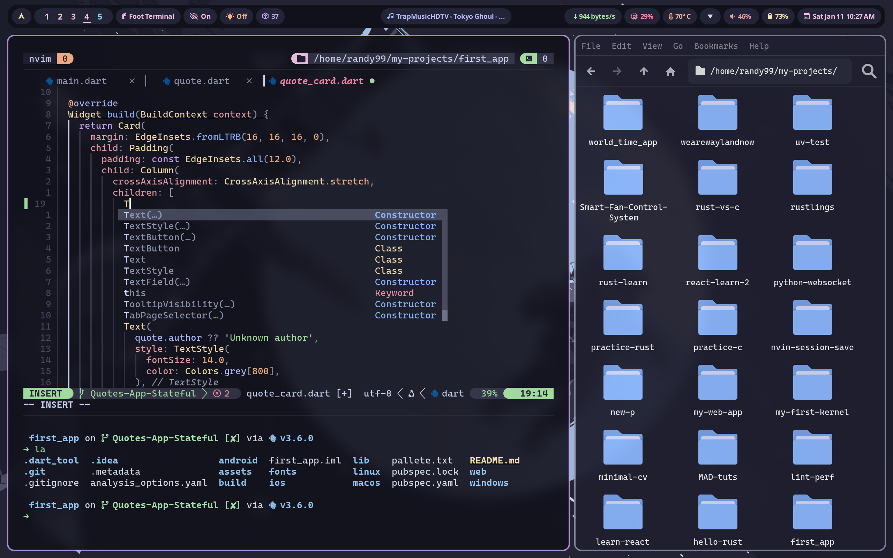

## Dotfiles-linux (Hyprland)

Dotfiles of my personal linux rice flavoured with catppuccin-mocha theme.

### Previews




### What's in?

01. WM - Hyprland
02. Bar - Waybar
03. Terminal emulator - Foot (default), Kitty, Wezterm
04. Shell - zsh
05. Terminal multiplexer - Tmux
06. Nerd font - CaskaydiaCove Nerd Font
07. Text editor and IDE - Neovim
08. Browser - Thorium (default), Firefox (with custom chrome.css)
09. File Manager - Thunar
10. Document viewer - Zathura
11. File Manager (Terminal) - Yazi
12. Git manager (Terminal) - Lazygit
13. Terminal LS replacement - eza
14. Terminal CD replacement - Zoxide
15. Terminal sysfetch - Fastfetch
16. App launcher - Rofi wayland fork

### How to use
I manage my dotfiles with GNU `stow`. follow the below steps to simlink the files to necessary locations.

1. Install with any package manager. (or build from source).

```bash
yay -S stow # replace with your package manager's syntax
```

2. clone the repo

```bash
git clone https://github.com/Chamal1120/dotfiles-linux-hyprland.git
```
3. Navigate to the directory

```bash
cd dotfiles-linux-hyprland/
```

4. Simlink the configs you need with `stow`.

```bash
stow bat btop fsh kitty nvim starship tmux yazi yt-dlp zsh hushlogin # A combined command should look like this
```

### Credits
Huge thank and respect to all the authors and maintainers of the open source softwares I have used for this setup.

### Thanks ❤️
Thank you for reading upto this point. Feel free to fork the repo if you need and don't forget to star.
