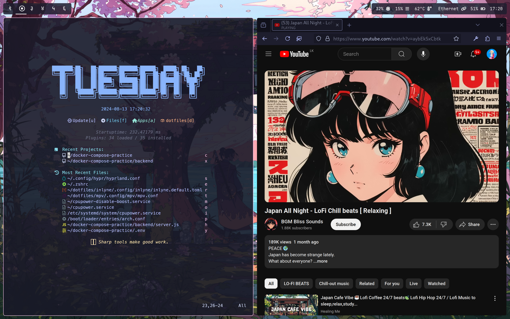
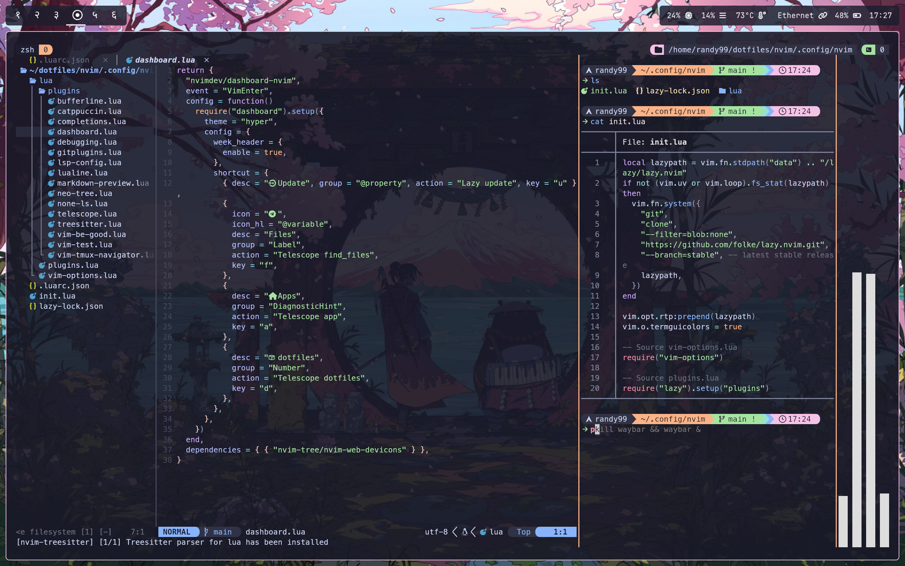

# Dotfiles-linux (Hyprland | TTY login | Catppuccin flavoured)

Dotfiles of my personal linux rice flavoured with catppuccin-mocha theme.

## Previews




## What's in?

1. `Hyprland` Window Manager and compositor
2. `Hypridle` Idle manager for hyprland
3. `Hyprlock` Lockscreen for hyprland
4. `Hyprpaper` Wallpaper manager for hyprland
5. `Waybar` Status bar
6. `Kitty` Terminal (wezterm config also available)
7. `Starship` Prompt
8. `eza` DIR lister
9. `vivid` $LS_COLOR manager 
10. `zoxide` cd replacement
11. `fzf` Fuzzy finder
12.  `bat` A cat(1) replacement
13. `fsh` Zsh syntax highlighting
14. `yazi` File explorer
15. `btop` System monitor
16. `neovim` (with LSP, Debugging, syntax highlighting and many more)
17. `tmux` terminal multiplexer
18. `fastfetch` sysfetch
19. `.hushlogin` file to disable "last login" message.

<br>

## How to use
I manage my dotfiles with GNU `stow`. follow the below steps to simlink the files to necessary locations.

1. Install with any package manager. (or build from source).

```bash
yay -S stow # replace with your package manager's syntax
```

2. clone the repo

```bash
git clone https://github.com/Chamal1120RE/dotfiles-linux.git
```
3. Navigate to the directory

```bash
cd dotfiles-linux/
```

4. Simlink the configs you need with `stow`.

```bash
stow bat btop fsh kitty nvim starship tmux yazi yt-dlp zsh hushlogin # This command will symlink all the configs
```

## Credits

This project uses the following open-source packages and applications. Special thanks to their authors and maintainers:

- [Git](https://github.com/git/git) - _A free and open source distributed version control system._
- [eza](https://github.com/eza-community/eza) - _A modern, maintained replacement for ls._
- [fd](https://github.com/sharkdp/fd) - _A simple, fast and user-friendly alternative to 'find'._
- [fzf](https://github.com/junegunn/fzf) - _A general-purpose command-line fuzzy finder._
- [ripgrep](https://github.com/BurntSushi/ripgrep) - _A line-oriented search tool that recursively searches the current directory for a regex pattern._
- [vivid](https://github.com/sharkdp/vivid) - _A themeable LS_COLORS generator with a rich filetype datebase._
- [Neovim](https://github.com/neovim/neovim) - _Hyperextensible Vim-based text editor._
- [tmux](https://github.com/tmux/tmux) - _A terminal multiplexer._
- [starship](https://github.com/starship/starship) - _The minimal, blazing-fast, and infinitely customizable prompt for any shell._
- [zsh-fast-syntax-highlighting](https://github.com/zdharma-continuum/fast-syntax-highlighting) - _Fast syntax highlighting for Zsh._
- [yazi](https://github.com/sxyazi/yazi) - _A TUI file explorer._
- [yt-dlp](https://github.com/yt-dlp/yt-dlp) - _A youtube-dl fork with additional features and fixes._
- [GNU Stow](https://git.savannah.gnu.org/cgit/stow.git) - _A symlink farm manager._
- [bat](https://github.com/sharkdp/bat) - _A cat(1) clone with syntax highlighting and Git integration._
- [btop](https://github.com/aristocratos/btop) - _A monitor for resources._
- [zoxide](https://github.com/ajeetdsouza/zoxide) - _A smarter cd command._
- [kitty](https://github.com/kovidgoyal/kitty) - _A cross-platform, fast, feature-rich, GPU based terminal emulator._
- [Firefox](https://github.com/mozilla/gecko-dev) - _The popular open-source web browser._

### and btw, thanks N3RDS ❤️
