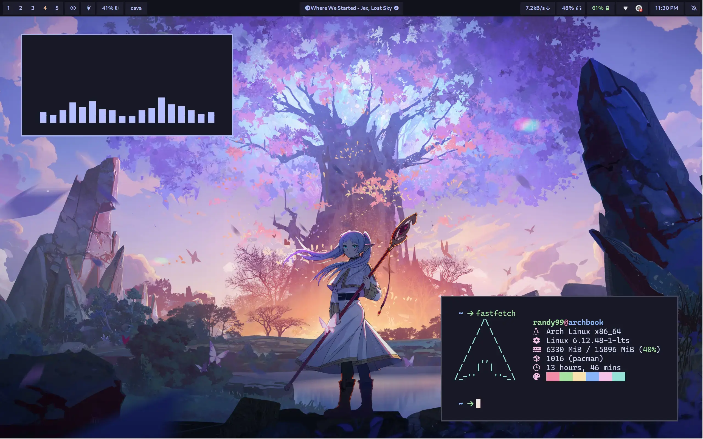
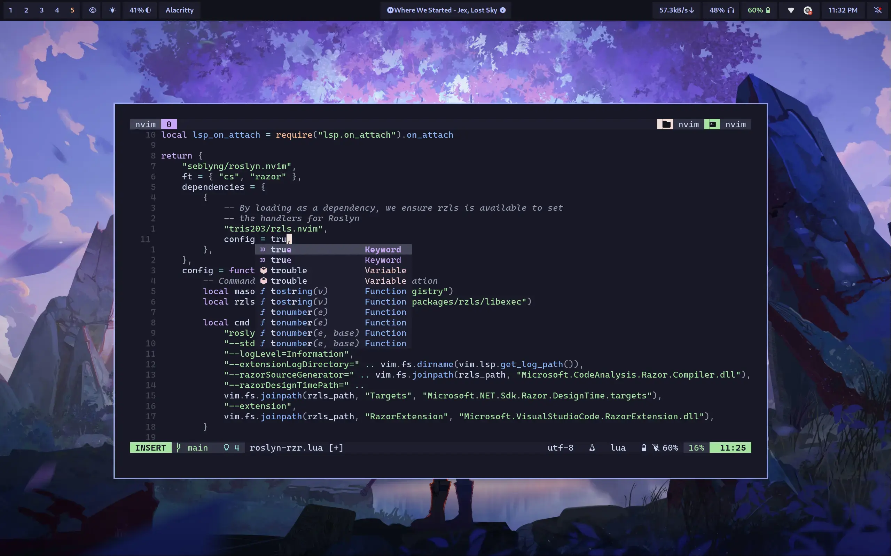

<div align="center">

# Chamal1120's Dotfiles
_My GNU/Linux setup for work_


</div>

## Previews


<br>


<details>

<summary>

## What's in?

</summary>

| #  | Component                 | Description                                         |
|-----|--------------------------|-----------------------------------------------------|
| 01 | Compositor               | Hyprland                                           |
| 02 | Bar                      | waybar                                             |
| 03 | Notification Daemon      | swaync                                             |
| 04 | Terminal emulator        | Alacritty                                          |
| 05 | Shell                    | zsh                                                |
| 06 | Terminal multiplexer     | tmux                                               |
| 07 | fonts                    | CaskaydiaCove NFM (term), Giest (GTK)              |
| 08 | Text editor and IDE      | Neovim                                             |
| 09 | Browser                  | Chrome                                             |
| 10 | File Manager (GUI)       | Thunar                                             |
| 11 | Document viewer          | Zathura                                            |
| 12 | File Manager (TUI)       | Yazi                                               |
| 13 | Git manager (TUI)        | Lazygit                                            |
| 14 | `ls` replacement         | eza                                                |
| 15 | `cat` replacement        | Bat                                                |
| 16 | sysfetch                 | Fastfetch                                          |
| 17 | App launcher             | Rofi (wayland fork)                                |
| 18 | Cursor theme             | Rose-pine-hyprland (wayland), BreezX-RosePine (X)  |
| 19 | Icon theme               | Papirus-Dark                                       |
| 20 | Icon color theme         | Catppuccin mocha lavender                          |

</details>

## Installation

> [!NOTE]
> This config is designed to setup on a vanilla base Arch Install.

1. Clone the repo and cd into it:
```bash
git clone --depth 1 --branch main --single branch https://github.com/chamal1120/dotfiles.git
cd dotfiles
```

2. Exit hyprland if you're currently in it.

```bash
hyprctl dispatch exit
```

> [!NOTE]
> If you're using a display manager, you can switch to a different DE or to a new tty using `ctrl + alt + f2`.

2. Run below command:

```bash
make rice
```

3. Enjoy!

## Manual Installation

Go to [here](/docs/manual_installation.md)

## Uninstallation

1. Exit hyprland:

```bash
hyprctl dispatch exit
```

2. Navigate to the configs directory in the git repo:

```bash
cd dotfiles-linux-hyprland/configs
```

3. Remove the symlinks:

```bash
stow -D --target=$HOME foot zsh fsh hyprland hyprpanel rofi starship nvim tmux yazi bat electron-flags-wayland icons  # Remove all the symlinks you linked earlier
```

## Contact

Hop in [here](https://discord.gg/PsxwFB4nJA)).

## Credits
To all FOSS creators, maintainers and contributors.

## License
[Do What The F*ck You Want To Public License (WTFPL)](LICENSE).
