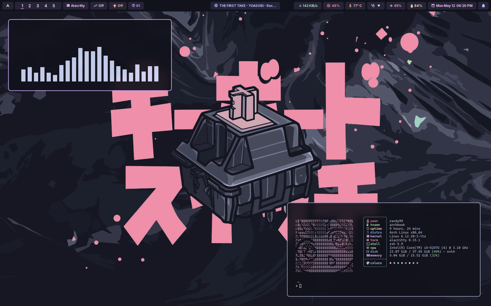
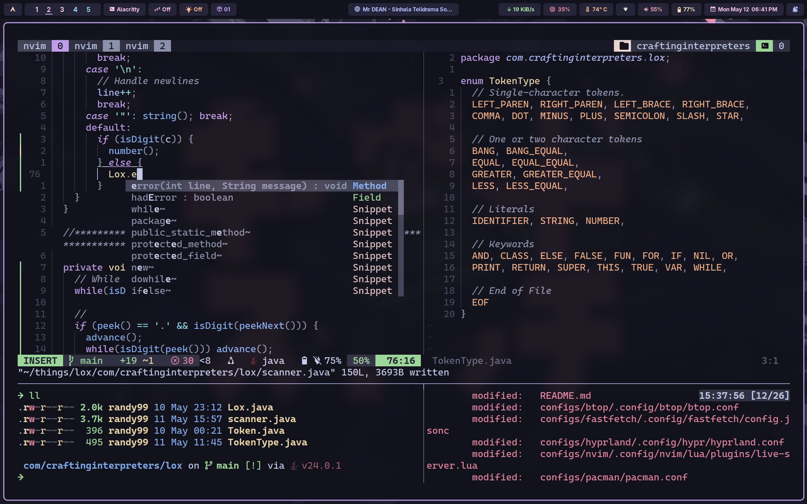
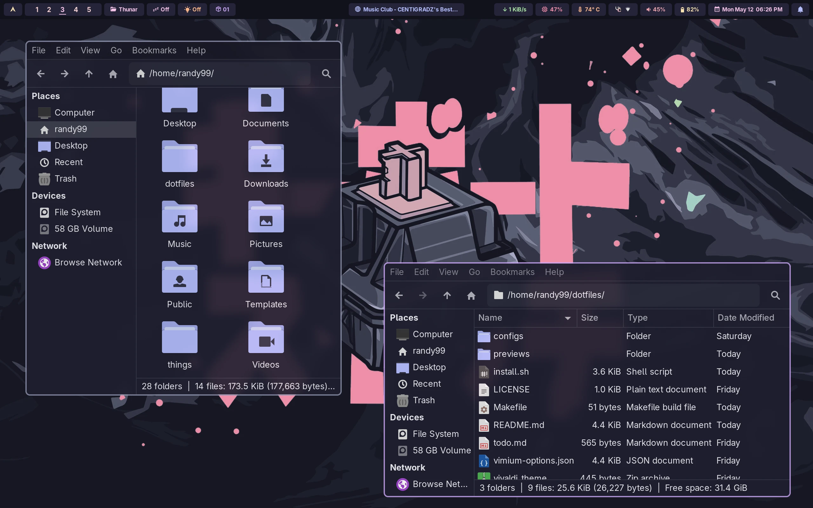

<div align="center">

# Dotfiles (WIP - Changing to a boxy UI)
_Everything that I'm currently daily driving on Linux._


</div>

## Previews (from the commit hash: a197024)

<br>

<br>

<br>


## What's in?
01. Compositor - Hyprland(Wayland)
02. Bar - waybar(default), Hyprpanel
03. Notification Daemon - swaync(for waybar only)
04. Terminal emulator - Alacritty (default), foot
05. Shell - zsh
06. Terminal multiplexer - tmux
07. Nerd font - CaskaydiaCove Nerd Font
08. Text editor and IDE - Neovim, Vim
09. Browser - Vivaldi, Firefox
10. File Manager(GUI) - Thunar
11. Document viewer - Zathura
12. File Manager (TUI) - Yazi
13. Git manager (TUI) - Lazygit
14. `ls` replacement - eza
15. `cd` replacement - Zoxide
16. `cat` replacement - Bat
17. sysfetch - Fastfetch
18. App launcher - Rofi wayland fork
19. Cursor theme - Rose-pine-hyprland (for Hyprland), BreezX-RosePine (for X)
20. Icon theme - Papirus-Dark
21. Icon color heme - Catppuccin mocha lavender

## Automated Install
> [!NOTE]
> This config is made for a minimal Arch Linux install and might conflict with any other customized distro.
> I recommend using a base Arch install (Hyprland install from ArchInstall Script works).

1. Clone the repo and cd into it:
```bash
git clone --depth 1 --branch main --single branch https://github.com/chamal1120/dotfiles.git
cd dotfiles
```

2. Exit hyprland if you're currently in it.

```bash
hyprctl dispatch exit
```

> [!NOTE]
> If you're using a display manager, you can switch to a different DE or to a new tty using `ctrl + alt + f2`.

2. Run below command:

```bash
make rice
```

3. Enjoy!

## Manual Install
I manage my dotfiles with GNU `stow`. follow the below steps to simlink the files to necessary locations.

> [!IMPORTANT]
> Please make sure you backup your exisitng configs first.

1. Install stow:

```bash
paru -S stow # replace with your package manager's syntax
```

2. clone the repo:

```bash
git clone --depth 1 --branch main --single branch https://github.com/chamal1120/dotfiles.git
```
3. Navigate to the configs directory in the git repo:

```bash
cd dotfiles-linux-hyprland/configs
```

4. Remove your existing conflicting configs otherwise stow would not symlink at all.

5. Exit hyprland (You cannot remove existing hyprland config while running it as it will create a new one automcatically).

```bash
hyprctl dispatch exit
```

6. Delete the existing hyprland config while in TTY.

```bash
rm -rf ~/.config/hypr
```

7. Simlink the configs you need with `stow`.

```bash
stow --target=$HOME foot zsh fsh hyprland hyprpanel rofi starship nvim tmux yazi bat electron-flags-wayland icons  # You can simlink multiple files like this
```

> [!IMPORTANT]
> * Clone fast-syntax-highlighting and zsh-auto-suggestions from their git repos.
> * Make sure that you have installed fast-syntax-highlighting and zsh-auto-suggestions to `$HOME/.zsh-plugins/`.
> * Please use **sudo** when simlinking pacman config.
> * Use the manual install for catppuccin tmux theme or change the .tmux.conf yourself to get it through tpm.

> [!NOTE]
> I have turned off the animations and blur in the hyprland config. You can turn them on by editing the `hyprland.conf` file in the `~/.config/hypr` directory.

## Removing the symlinks

1. Exit hyprland:

```bash
hyprctl dispatch exit
```

2. Navigate to the configs directory in the git repo:

```bash
cd dotfiles-linux-hyprland/configs
```

3. Remove the symlinks:

```bash
stow -D --target=$HOME foot zsh fsh hyprland hyprpanel rofi starship nvim tmux yazi bat electron-flags-wayland icons  # Remove all the symlinks you linked earlier
```
## Community

Click [here](https://discord.gg/PsxwFB4nJA) and hop onto my discord to talk about tech, vim, linux and all other degenerative stuff :-)

## Credits
All credits and respect goes to all the authors and maintainers of the open source software I have used for this setup.

## License
This peice of software is licensed under MIT.
